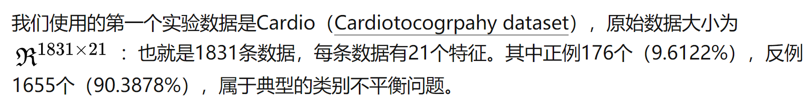
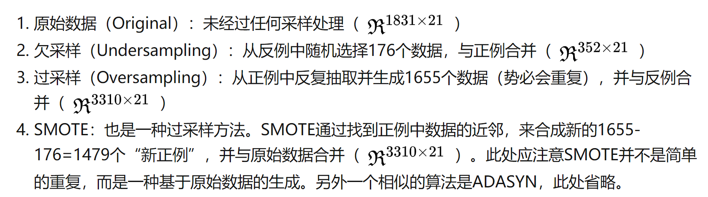

# 模型选择

*列举常见模型，简单介绍*

> **调参目标：偏差和方差的协调**

### Random Forest

`n_estimators`：越多越好，但对准确度的提升有上限。

`criterion`：分裂条件，如

- 信息增益（偏好取值多的属性）
- 增益率（偏好取值少的属性）
- 基尼系数

### XGBoost

##### booster参数：

*参数可以使用CV函数自动调整*

`gamma`⭐:

- 在节点分裂时，只有分裂后损失函数的值下降了，才会分裂这个节点。Gamma指定了节点分裂所需的最小损失函数下降值。
- 这个参数的值越大，算法越保守。这个参数的值和损失函数息息相关，所以是需要调整的。

##### 学习目标参数：

##### 过采样：调整数据不平衡

不平衡：

过采样：

不平衡其他方法：

* 调整阈值

* 使用ROC曲线衡量

##### 参考：

https://blog.csdn.net/qq_16633405/article/details/58595750

https://blog.csdn.net/u010657489/article/details/51952785